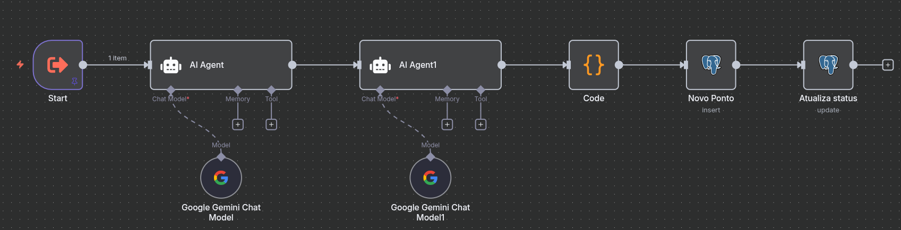
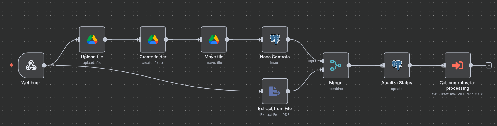

# 🤖 N8N Fluxos - Sistema de Análise Contratual Automatizada

Este diretório contém os fluxos do N8N para um sistema completo de análise contratual automatizada que utiliza IA para analisar contratos jurídicos.

## 📁 Estrutura dos Fluxos

```
n8n-fluxos/
├── contrato.json                    # Fluxo principal (recebe e processa contratos)
├── contratos-ia-processing.json     # Subflow (análise de IA)
└── README.md                       # Este arquivo
```

## 🎯 Funcionalidades do Sistema

### **Fluxo Principal (`contrato.json`)**
- Recebe contratos via webhook
- Extrai texto de PDFs
- Armazena arquivos no Google Drive
- Registra contratos no PostgreSQL
- Chama análise de IA



### **Subflow (`contratos-ia-processing.json`)**
- Analisa contratos com IA (Google Gemini)
- Gera 4 seções de análise:
  - **Seção 1**: Extração de Dados Essenciais
  - **Seção 2**: Análise de Riscos e Cláusulas Perigosas
  - **Seção 3**: Identificação de Brechas e Inconsistências
  - **Seção 4**: Parecer Final e Recomendações
- Armazena resultados no PostgreSQL



## 🚀 Como Importar os Fluxos

### 1. **Subir o Ambiente Docker**
```bash
# Na pasta dockers/
cd /home/luisoliveira/desenvolvimento/ross/dockers

# Subir todos os serviços (incluindo PostgreSQL com inicialização automática)
docker-compose up -d

# Verificar se todos os serviços estão rodando
docker-compose ps
```

### 2. **Acesse o N8N**
```bash
# URL do N8N
http://localhost:5678

# Credenciais padrão
Usuário: admin
Senha: admin123
```

**Nota:** O PostgreSQL será inicializado automaticamente com as tabelas necessárias na primeira execução.

### 3. **Importar o Fluxo Principal**
1. No N8N, vá em **Workflows** → **Import from File**
2. Selecione o arquivo `contrato.json`
3. Clique em **Import**

### 4. **Importar o Subflow**
1. Repita o processo para `contratos-ia-processing.json`
2. Certifique-se de que ambos os fluxos estão importados

## ⚙️ Configurações de Credenciais

### **1. Google Drive API**
**Nó:** `Upload file`, `Create folder`, `Move file`

**Configuração:**
1. Acesse [Google Cloud Console](https://console.cloud.google.com/)
2. Crie um projeto ou selecione existente
3. Ative a **Google Drive API**
4. Crie credenciais OAuth 2.0
5. Configure o consentimento OAuth
6. No N8N, vá em **Credentials** → **Add Credential**
7. Selecione **Google Drive OAuth2 API**
8. Cole o **Client ID** e **Client Secret**
9. Configure o **Scope**: `https://www.googleapis.com/auth/drive`

**Pasta de Destino:**
- ID da pasta: `1HhcJIkTP47ACAiQo1MPwOUJ3aTD7Syjr`
- Nome: `contratos`

### **2. PostgreSQL Database**
**Nó:** `Novo Contrato`, `Atualiza Status`, `Novo Ponto`, `Atualiza status`

**Configuração:**
1. No N8N, vá em **Credentials** → **Add Credential**
2. Selecione **Postgres**
3. Configure:
   - **Host**: `postgresql` (se usando Docker) ou IP do servidor
   - **Port**: `5432`
   - **Database**: `ross`
   - **User**: `postgres`
   - **Password**: `postgres123`
   - **SSL**: `disable` (para desenvolvimento)

**Tabelas Necessárias:**
As tabelas são criadas automaticamente quando o PostgreSQL sobe pela primeira vez. O script `init.sql` está localizado em `/dockers/postgresql/init.sql` e contém:

- **contracts**: Armazena informações dos contratos
- **analysis_data_points**: Armazena pontos de análise da IA
- **Índices**: Para otimização de performance
- **Views**: Para consultas facilitadas

**Importante:** O banco de dados será inicializado automaticamente na primeira execução do Docker.

### **3. Google Gemini API**
**Nó:** `Google Gemini Chat Model`, `Google Gemini Chat Model1`

**Configuração:**
1. Acesse [Google AI Studio](https://aistudio.google.com/)
2. Crie uma API Key
3. No N8N, vá em **Credentials** → **Add Credential**
4. Selecione **Google PaLM API**
5. Cole a **API Key**

**Configurações do Modelo:**
- **Max Output Tokens**: `64000`
- **Temperature**: `0.2`

## 🔧 Configurações Adicionais

### **1. Webhook URL**
O fluxo principal usa um webhook com ID: `96a31298-7d8d-4006-b434-40917d08a9b0`

**URL completa:**
```
http://localhost:5678/webhook/96a31298-7d8d-4006-b434-40917d08a9b0
```

### **2. Configurações de Rede**
- **Network**: `ross-network` (se usando Docker)
- **PostgreSQL Host**: `postgresql` (nome do container)

### **3. Variáveis de Ambiente**
Configure no N8N ou no Docker:
```env
N8N_BASIC_AUTH_ACTIVE=true
N8N_BASIC_AUTH_USER=admin
N8N_BASIC_AUTH_PASSWORD=admin123
N8N_HOST=localhost
N8N_PORT=5678
N8N_PROTOCOL=http
```

## 📋 Como Usar o Sistema

### **1. Ativar os Fluxos**
1. No N8N, vá em **Workflows**
2. Ative o fluxo `contrato` (principal)
3. Ative o fluxo `contratos-ia-processing` (subflow)

### **2. Enviar um Contrato**
```bash
# Exemplo de envio via curl
curl -X POST http://localhost:5678/webhook/96a31298-7d8d-4006-b434-40917d08a9b0 \
  -F "contrato=@/caminho/para/contrato.pdf"

# Exemplo com arquivo de teste
curl -X POST http://localhost:5678/webhook/96a31298-7d8d-4006-b434-40917d08a9b0 \
  -F "contrato=@contrato_teste.pdf"
```

### **3. Monitorar Execução**
1. Vá em **Executions** no N8N
2. Acompanhe o progresso dos fluxos
3. Verifique logs em caso de erro

### **4. Verificar Resultados**
```sql
-- Ver contratos processados
SELECT * FROM contracts WHERE status = 'processed';

-- Ver pontos de análise
SELECT 
    c.original_filename,
    adp.section_id,
    adp.label,
    adp.content
FROM contracts c
JOIN analysis_data_points adp ON c.id = adp.contract_id
ORDER BY c.created_at DESC, adp.section_id, adp.display_order;
```

## 🔍 Estrutura da Análise de IA

### **Seção 1: Dados Essenciais**
- Partes envolvidas
- Objeto do contrato
- Valores e prazos
- Obrigações principais

### **Seção 2: Riscos e Cláusulas Perigosas**
- Cláusulas leoninas
- Desequilíbrios contratuais
- Riscos jurídicos
- Pontos de atenção

### **Seção 3: Brechas e Inconsistências**
- Ambiguidades no texto
- Falhas de redação
- Inconsistências internas
- Impactos potenciais

### **Seção 4: Parecer Final**
- Recomendações gerais
- Sugestões de alterações
- Avaliação de risco geral
- Próximos passos

## 🛠️ Troubleshooting

### **Problema: Erro de credenciais**
- Verifique se todas as credenciais estão configuradas
- Teste a conexão com cada serviço
- Verifique se as APIs estão ativadas

### **Problema: Erro de banco de dados**
- Verifique se o PostgreSQL está rodando
- Confirme se as tabelas foram criadas
- Teste a conexão com o banco

### **Problema: Erro de IA**
- Verifique se a API do Google Gemini está ativa
- Confirme se há créditos disponíveis
- Verifique se o texto do contrato não está muito longo

### **Problema: Erro de Google Drive**
- Verifique se a API está ativada
- Confirme se as permissões estão corretas
- Teste o upload manual

## 📊 Monitoramento

### **Logs Importantes**
- **Webhook**: Recebimento de contratos
- **Extract from File**: Extração de texto
- **AI Agent**: Análise de IA
- **PostgreSQL**: Inserção de dados

### **Métricas Úteis**
- Número de contratos processados
- Tempo médio de processamento
- Taxa de sucesso das análises
- Uso de créditos da IA

## 🔒 Segurança

### **Recomendações**
- Use senhas fortes para todas as credenciais
- Configure HTTPS em produção
- Monitore logs de acesso
- Faça backup regular dos dados
- Mantenha as APIs atualizadas

### **Dados Sensíveis**
- Os contratos são armazenados no Google Drive
- O texto é processado pela IA do Google
- Dados são criptografados em trânsito
- Configure retenção de dados conforme LGPD

## 📞 Suporte

Para dúvidas ou problemas:
1. Verifique os logs de execução no N8N
2. Consulte a documentação das APIs
3. Teste cada componente individualmente
4. Verifique as configurações de rede

---

**Versão**: 1.0  
**Última atualização**: Janeiro 2025  
**Compatibilidade**: N8N v1.0+
